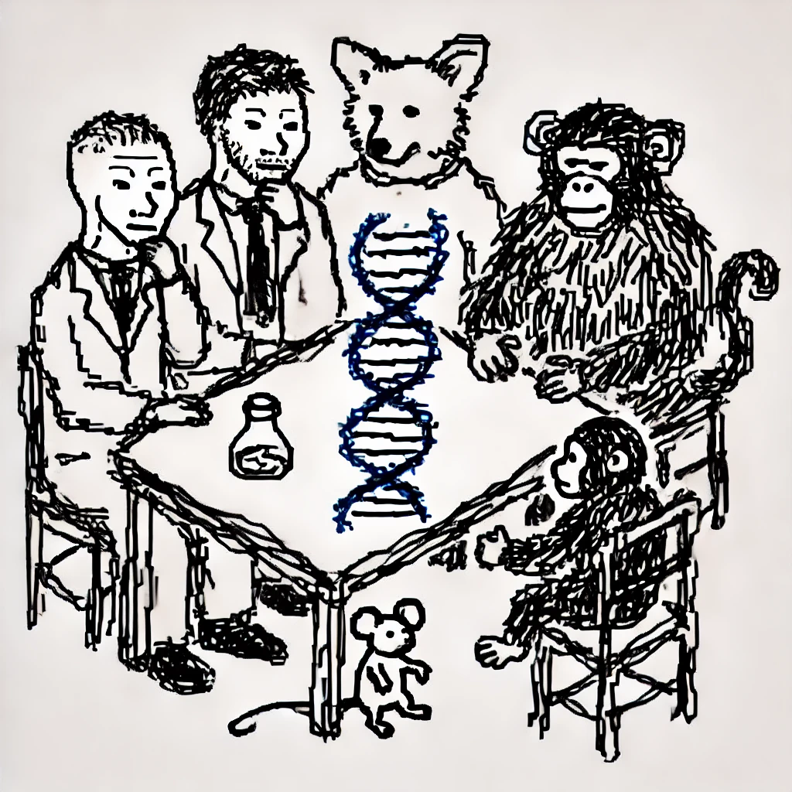

<p align="center">
  
</p>

# "Frustratingly easy" domain adaptation for cross-species transcription factor binding prediction

The following code pairs with what we report in the work above. We provide an non adversarial approach, under the scope of unsupervised domain-adaptation, to characterize regulatory genomic function (i.e., transcription factor binding).

If you would like to go through the manuscript, it will be available on the following platforms:
- [bioRxiv](https://www.britannica.com/animal/cat)
- [ICIBM 2025 (Hopefully)](https://www.greensboro.carolinavet.com/site/greensboro-specialty-veterinary-blog/2023/03/15/how-to-choose-cat-breed)
- [Journal (Eventually)](https://www.nationalgeographic.com/animals/mammals/facts/domestic-cat)

We present two case studies in this work: (1): A two-species, and (2): a multi-species implementation. Since we use different frameworks and data for both, I made nested `README`s that are more specific for each. The `README`s will guide you through the data createion, training procedures, and figure-making -- each of these can be found under the respective folders, `multi-species` and `two-species`. You will need python environments to run any of the code; I create a `conda-envs` folder that has yamls you can use to get setup. We use both Tensorflow and PyTorch. See below for details.

## Requirements

We use two ML frameworks for this work: (1) TensorFlow and (2): PyTorch. TensorFlow is used for the two-species case as we broadly want to capture the findings in previous work ([Cochran et al.](https://genome.cshlp.org/content/32/3/512.full#sec-1)). For our extension to the multi-species case, we use PyTorch, however we do not utilize the 'optimizations' made in PyTorch Lighthing (though it seems cool...I'll do it some other time).

For model training and the like, we used the HPC available to students in the University of Pittsburgh's School of Medicine (i.e., more specifically the [Department of Computational and Systems Biology](https://www.csb.pitt.edu/)). It utilizes [SLURM](https://slurm.schedmd.com/documentation.html), so any of the scripts that I made are centered around that. Primarily, this code ran on NVIDIA L40 GPUs.

### Two-species analyses (TensorFlow)

`conda-envs/tensorflow.yaml`

### Multi-species analyses (PyTorch)

`conda-envs/pytorch.yaml`

## How to cite

```
TBD
```